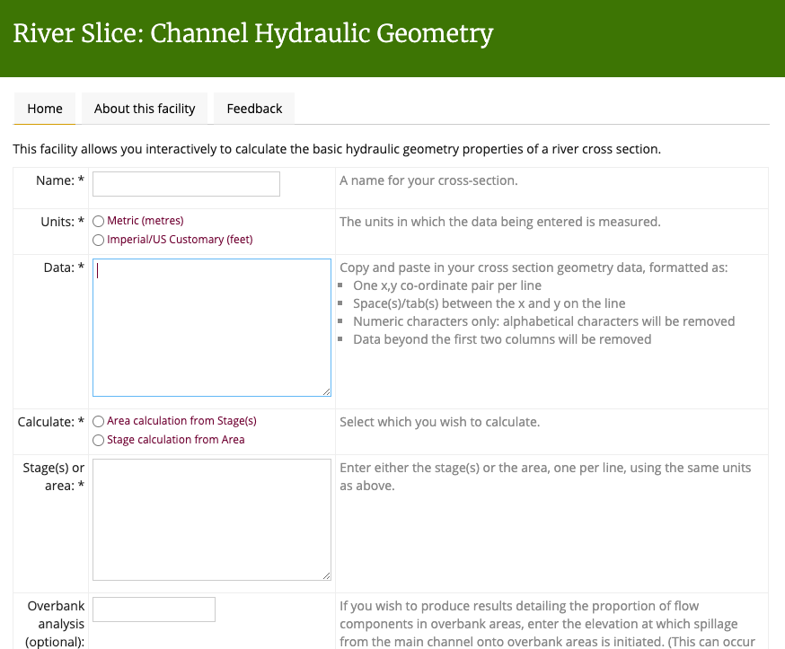

Riverslice - Channel hydraulic geometry calculation tool
========================================================

This is a PHP application to create an online channel hydraulic geometry calculation tool.

Screenshot
----------

Usage
-----

1. Clone the repository.
2. Run `composer install` to install the dependencies.
3. Add the Apache directives in httpd.conf (and restart the webserver) as per the example given in .httpd.conf.extract.txt; the example assumes mod_macro but this can be easily removed.
4. Create a copy of the index.html.template file as index.html, and fill in the parameters.
5. Access the page in a browser at a URL which is served by the webserver.

Dependencies
------------

Installed via Composer.

Author
------

Formulae derived by Renée Kidson 2003-4.

Coding by Martin Lucas-Smith, Department of Geography, University of Cambridge, 2003-10, 2020, 2024.

License
-------

GPL3.

